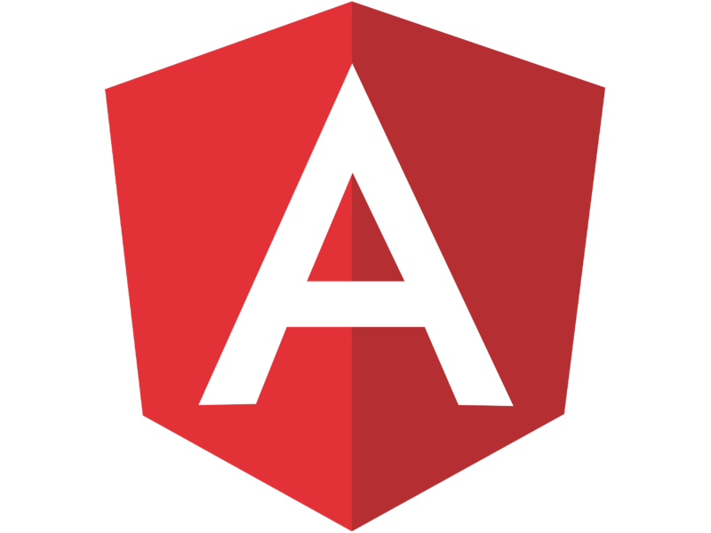

# CS NOTEBOOK (FRONTEND)

## :book: INTRODUCTION :book:
   
This repository hosts the source code for the front-end of the CS Notebook Project. CS Notebook is a learning resource & study platform for users to hone their skills and understanding of the many disciplines within the field of computer science. Whether you're a professional gearing up for an important interview, or a student looking to develop your understanding of complex topics, CS Notebook is dedicated to providing free and accessible education for all.

## :computer: CORE TECHNOLOGIES :computer:
        
      

&nbsp;&nbsp;&nbsp;&nbsp;&nbsp;&nbsp;&nbsp;&nbsp;&nbsp;&nbsp;&nbsp;&nbsp;  

## :cloud: CLOUD TECHNOLOGIES DEPLOYMENT :cloud:
   

&nbsp;&nbsp;

## :chart_with_upwards_trend: WIREFRAMES :chart_with_upwards_trend:

